# DEVLOG — KitOper

Дневник разработки. Читай перед тем как что-то трогать.

---

## Что это за проект

**KitOper** — веб-система управления расписанием колледжа. Laravel 12 + Bootstrap 5 + Tailwind (только в сборке, UI на Bootstrap). База — MySQL 8. Кэш — Redis. AI — Ollama (локальная модель, по умолчанию qwen2.5:3b).

Три роли: `dispatcher` (полный доступ), `teacher` (только свои пары), `student` (просмотр).

---

## Как запустить локально

```bash
cp .env.example .env          # или возьми .env из команды
docker compose up -d           # docker-compose.yml лежит в корне проекта
php artisan migrate            # если БД пустая
php artisan db:seed            # опционально
```

Приложение доступно на `http://localhost:8000`.  
phpMyAdmin — `http://localhost:8081`.

> **Важно:** контейнер `DataBase` (MySQL) иногда падает при рестарте системы. Проверяй командой `docker ps` и при необходимости `docker start DataBase`.

---

## Скриншоты интерфейса

### Вход в систему

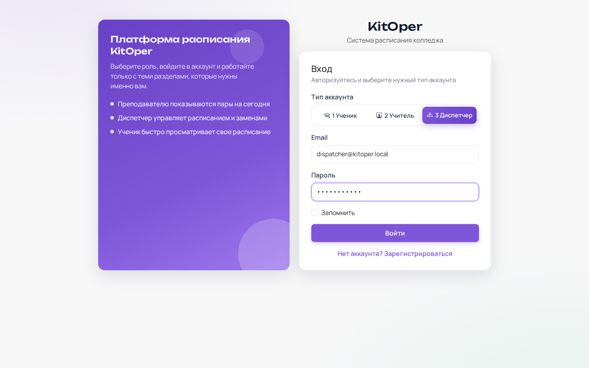

Страница `/login`. Слева — описание ролей. Справа — форма входа с переключателем роли:
- **Ученик** — просмотр расписания своей группы
- **Учитель** — просмотр своих пар
- **Диспетчер** — полный доступ ко всем разделам

При входе как Диспетчер (`dispatcher@kitoper.local`) открывается главная страница расписания.

---

### Расписание — главный экран

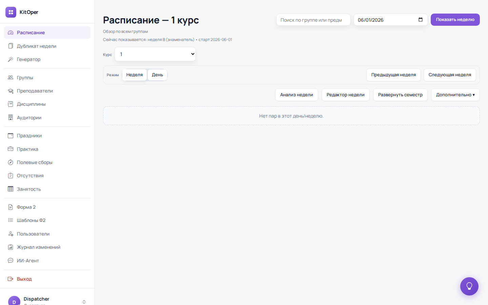

Маршрут: `GET /schedule` → режим «Неделя». После логина диспетчер сразу попадает сюда.

Ключевые элементы:
- **Строка под заголовком** — отображает текущий режим недели: `неделя B (знаменатель) • старт 2026-06-01`. Логика определения числителя/знаменателя — в `FirstCourseSchedulePageController::getCurrentWeekMode()`.
- **Фильтр по группе или предмету** — поиск в шапке, справа от заголовка.
- **Выбор даты + «Показать неделю»** — позволяет перейти к любой неделе семестра.
- **Дропдаун «Курс»** — переключение между курсами (1–4).
- **Кнопки «Неделя» / «День»** — переключение режима отображения.
- **«Анализ недели»**, **«Редактор недели»**, **«Развернуть семестр»**, **«Дополнительно ▾»** — инструменты диспетчера.
- **Кнопка ? Помощь** (правый нижний угол, фиолетовый кружок) — запускает Driver.js тур по странице. Появляется только если на странице загружен тур.

---

### Расписание — режим День

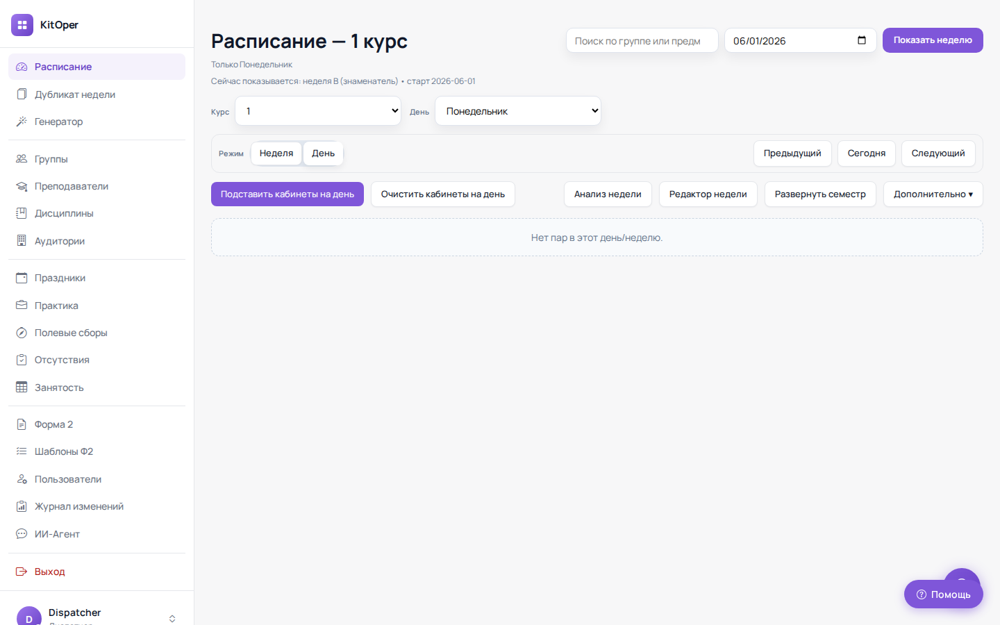

Переключается кнопкой «День» или переходом по URL `/schedule/day`.

Дополнительные кнопки в режиме дня:
- **«Подставить кабинеты на день»** — автоматически расставляет аудитории для всех пар текущего дня.
- **«Очистить кабинеты на день»** — убирает все аудитории дня.
- Навигация: **«Предыдущий» / «Сегодня» / «Следующий»** вместо «Предыдущая неделя / Следующая неделя».

> В правом нижнем углу видна кнопка **«? Помощь»** с подписью — это показывает что тур `schedule-day.js` загружен.

`index.blade.php` определяет какой тур загрузить по `window.location.pathname` (day vs week).

---

### Форма 2

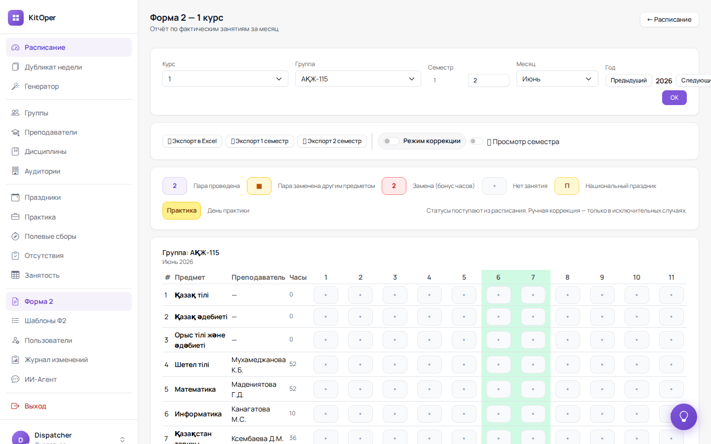

Маршрут: `GET /form-two`. Официальный журнал учёта часов.

**Фильтры вверху:** Курс → Группа → Семестр → Месяц → Год → кнопка «OK».  
На скриншоте: группа **АКЖ-115**, 1 семестр, Июнь 2026.

**Кнопки экспорта:**
- «Экспорт в Excel» — текущий месяц
- «Экспорт 1 семестра» / «Экспорт 2 семестра»

**Переключатели:**
- **«Режим коррекции»** — разрешает ручное редактирование ячеек (только для исключений).
- **«Просмотр семестра»** — разворачивает Ghost-режим (прогноз до конца семестра).

**Легенда статусов** (показана под кнопками):
| Индикатор | Значение |
|-----------|----------|
| `2` (фиолетовый) | Пара проведена |
| `■` (оранжевый) | Пара заменена другим предметом |
| `2` (красный) | Замена (бонус часов) |
| `•` (точка) | Нет занятия |
| `П` (жёлтый) | Национальный праздник |
| `Практика` (жёлтый бейдж) | День практики |

**Таблица:** строки = предметы группы (из `form_two_normatives`), колонки = дни месяца. Выходные дни (6–7) выделены зелёным фоном.

> Если таблица пустая — нет нормативов в `form_two_normatives` для этой группы. Также проверь наличие колонки `semester` (добавлена миграцией `2027_07_02`).

---

### Преподаватели

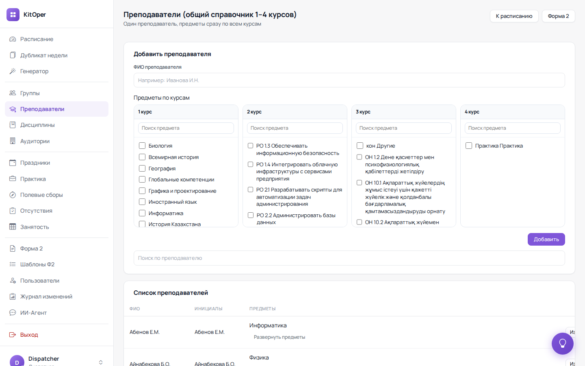

Маршрут: `GET /teachers`. Общий справочник для всех курсов.

Верхняя форма **«Добавить преподавателя»**:
- Поле ФИО
- Чекбоксы предметов по каждому курсу (1–4) с поиском внутри каждого столбца
- Один преподаватель может вести предметы сразу на нескольких курсах

Нижняя часть — **«Список преподавателей»** с колонками: ФИО, Инициалы, Предметы (со ссылкой «Развернуть предметы»).

---

### Группы

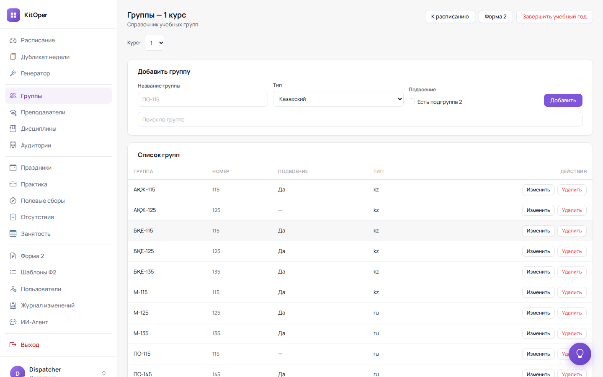

Маршрут: `GET /groups`. Справочник учебных групп.

Форма добавления: Название (напр. «ПО-115»), Тип (Казахский / Русский), чекбокс «Есть подгруппа 2».

Список групп включает: Название, Номер, Подвоение (Да / —), Тип (kz / ru), кнопки «Изменить» / «Удалить».

В правом верхнем углу — кнопка **«Завершить учебный год»** (красная) — переводит группы на следующий курс.

---

### Генератор расписания

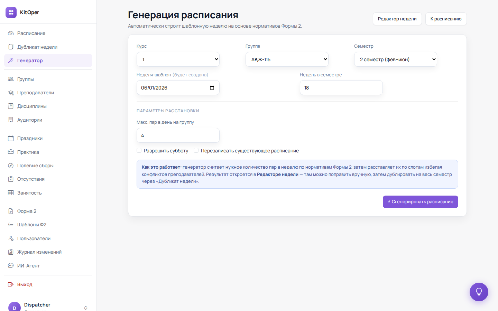

Маршрут: `GET /generator`.

Параметры генерации:
- **Курс** и **Группа** — для какой группы строить
- **Семестр** — «2 семестр (фев-июн)»
- **Неделя-шаблон** — дата недели, которая будет создана как шаблон
- **Недель в семестре** — сколько недель охватывает семестр (по умолчанию 18)
- **Макс. пар в день на группу** — ограничение (по умолчанию 4)
- **«Разрешить субботу»** — учитывать субботу при расстановке
- **«Перезаписать существующее расписание»** — удалить текущее перед генерацией

**Как работает** (текст прямо на странице):  
> Генератор считает нужное количество пар в неделю по нормативам Формы 2, затем расставляет их по слотам избегая конфликтов преподавателей. Результат откроется в **Редакторе недели** — там можно поправить вручную, затем дублировать на весь семестр через «Дубликат недели».

---

### Дубликат недели

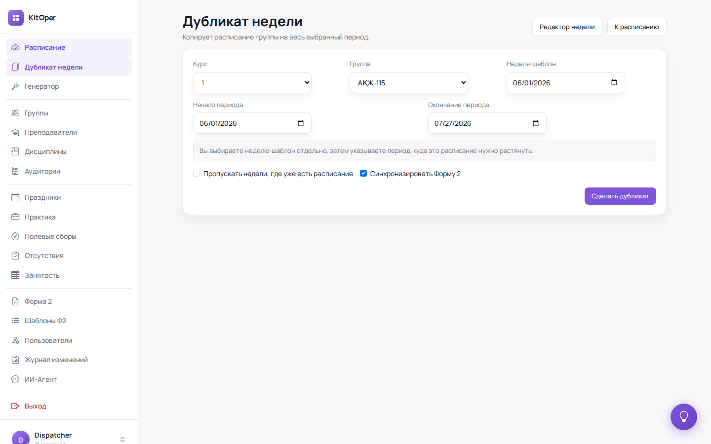

Маршрут: `GET /week-duplicate`. Копирует расписание одной недели на заданный период.

Параметры:
- **Курс / Группа** — для какой группы
- **Неделя-шаблон** — исходная неделя (выбирается отдельно от периода)
- **Начало периода / Окончание периода** — куда растянуть расписание
- **«Пропускать недели, где уже есть расписание»** — не перезаписывать заполненные недели
- **«Синхронизировать Форму 2»** ✅ — при дублировании автоматически обновить нормативы Ф2

---

### Занятость преподавателей

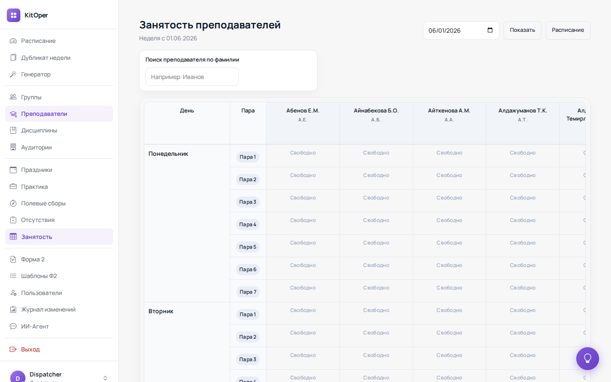

Маршрут: `GET /workload`. Матрица занятости всех преподавателей на неделю.

**Оси таблицы:** День (строки, сгруппированные по дням недели) × Преподаватель (столбцы). Внутри — «Свободно» или название группы/предмета.

**Поиск по фамилии** — фильтрует столбцы таблицы в реальном времени.  
**Дата + «Показать»** — переход к нужной неделе.

Используется для проверки конфликтов при составлении расписания вручную.

---

### Полевые сборы

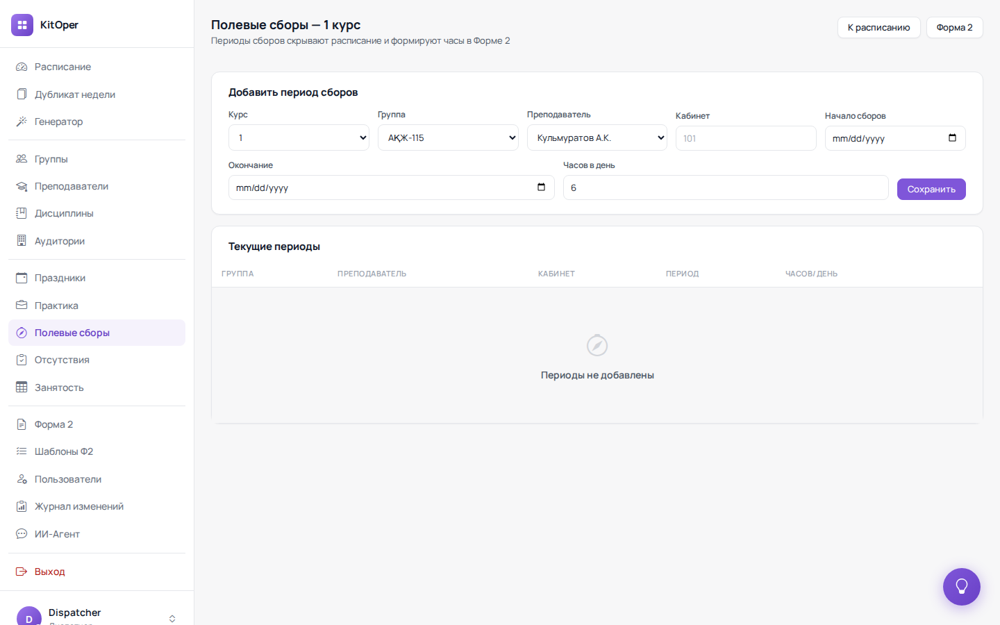

Маршрут: `GET /field-camps`. Периоды, когда группа на полевых сборах.

Параметры периода: Курс, Группа, Преподаватель, Кабинет, Начало, Окончание, Часов в день (по умолчанию 6).

> Периоды сборов **скрывают расписание** группы и **формируют часы в Форме 2** автоматически — отдельные строки за каждый день сборов.

---

### Шаблоны Формы 2

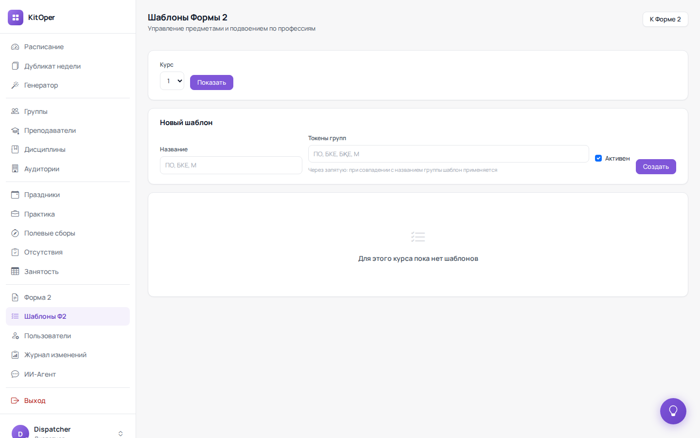

Маршрут: `GET /form-two-templates`. Управляет тем, какие предметы попадают в нормативы Ф2.

Форма «Новый шаблон»:
- **Название** — например «ПО, БКЕ, М»
- **Токены групп** — через запятую: при совпадении с названием группы шаблон применяется автоматически
- **Активен** — чекбокс

Шаблон определяет список строк (предметов и нормативов часов), которые появятся в Форме 2 для соответствующих групп.

---

### Пользователи

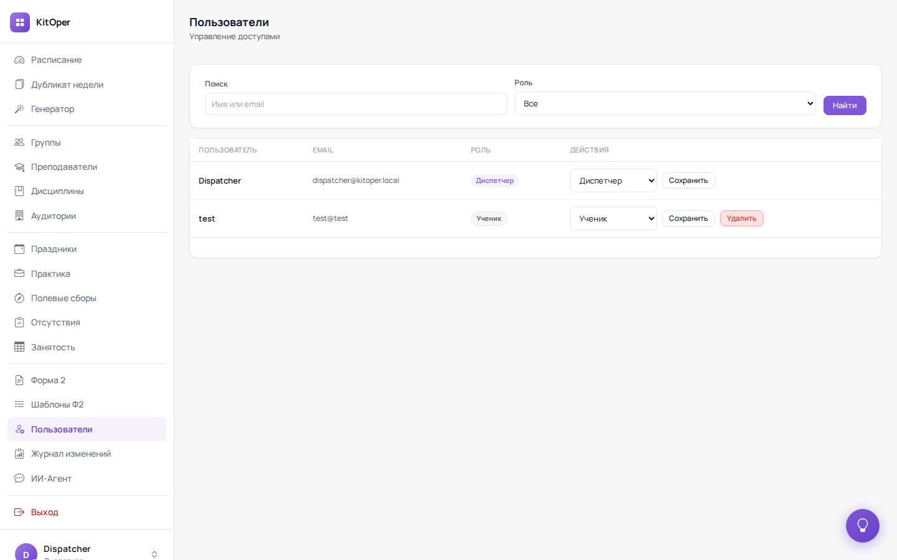

Маршрут: `GET /users`, только для диспетчера.

Таблица пользователей: имя, email, роль (бейдж). Каждая строка — дропдаун смены роли + «Сохранить» + «Удалить».  
Поиск по имени/email и фильтр по роли.

> Нельзя удалить или изменить роль себе (своя строка заблокирована от удаления).

---

### API эндпоинты (JSON)

Несколько скриншотов (`page-availability.png`, `page-free-rooms.png`, `page-free-teachers.png`, `page-health.png`, `page-holiday-comp.png`) — это браузерный вывод JSON-эндпоинтов диагностики:

```json
{"warnings":[],"counts":{"danger":0,"warning":0,"info":0},"holidays":[],"ok":true}
```

Это внутренние API, которые вызывает фронтенд (и Генератор) для проверки конфликтов расписания. Поля:
- `warnings` — список конфликтов (пустой = всё чисто)
- `counts.danger` — критичные конфликты (преподаватель в двух группах одновременно)
- `counts.warning` — предупреждения (кабинет занят)
- `ok: true` — статус проверки

---

## Архитектура проекта

```
. (корень проекта)
├── app/Http/Controllers/     # Контроллеры (один файл — один раздел)
├── app/Http/Middleware/      # auth, role, audit
├── app/Models/               # User, Group, Teacher, Subject, Room, ...
├── app/Services/             # Бизнес-логика (FormTwo, Ghost, Schedule...)
├── resources/views/          # Blade-шаблоны
│   ├── layouts/app.blade.php # Главный layout с sidebar
│   ├── first_course/         # Расписание и Форма 2 (1 курс)
│   ├── docs/index.blade.php  # Страница документации
│   └── ...
├── public/
│   ├── css/                  # Статические CSS (не через Vite)
│   └── js/
│       └── tours/            # Driver.js туры (см. ниже)
├── routes/web.php
└── database/migrations/
```

### Важное про CSS и JS

Проект **не использует Vite для страничного JS**. Весь JS — inline в Blade через `@push('scripts')` или отдельные файлы в `public/js/`. Vite собирает только `app.css` и `app.js` (bootstrap/axios).

CDN-зависимости в `layouts/app.blade.php`:
- Bootstrap 5.3.3
- Bootstrap Icons 1.11.3
- Driver.js 1.x (для туров)

---

## Числитель и знаменатель

Расписание чередуется еженедельно: неделя A (числитель) → неделя B (знаменатель). Логика определения: стартовая дата семестра + чётность недели. Смотри `FirstCourseSchedulePageController::getCurrentWeekMode()`.

На скриншотах — `неделя B (знаменатель) • старт 2026-06-01`, это значит что стартовая дата семестра 1 июня 2026, и текущая неделя — знаменатель.

---

## Форма 2

Официальный журнал учёта часов. Строки берутся из **нормативов** (`form_two_normatives`). Нормативы строятся из **шаблонов** (`form_two_templates`).

Колонка `semester` в `form_two_normatives` — добавлена миграцией `2027_07_02`. Если делаешь свежий импорт SQL-дампа — проверь что она есть:

```sql
DESCRIBE form_two_normatives;
-- должна быть колонка semester TINYINT
```

Если нет — запусти:
```sql
ALTER TABLE form_two_normatives ADD COLUMN semester TINYINT UNSIGNED AFTER teacher_id;
UPDATE form_two_normatives SET semester = CASE WHEN month >= 9 THEN 1 ELSE 2 END;
```

---

## Ghost-режим (прогноз Формы 2)

Сервис `SemesterGhostService`. При включении переключателя `#ghostToggle` подгружает данные шаблона расписания и проецирует их на оставшиеся дни месяца. Данные НЕ пишутся в БД — только для отображения.

---

## Система интерактивных туров (Driver.js)

Добавлена в июне 2026. Кнопка «? Помощь» — фиксированная, правый нижний угол, появляется только если на странице загружен тур.

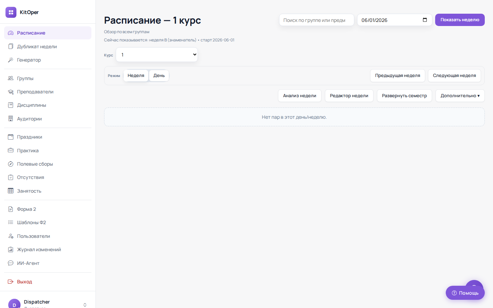

На скриншоте расписания в режиме «Неделя» кнопка отображается как фиолетовый кружок с иконкой `?`. В режиме «День» кнопка разворачивается с подписью **«? Помощь»** (см. [page-schedule-day.png](../plan/screenshots/page-schedule-day.png)).

### Файлы

| Файл | Страница |
|------|----------|
| `public/js/tours/schedule-index.js` | Расписание (неделя) |
| `public/js/tours/schedule-day.js` | Расписание (день) |
| `public/js/tours/schedule-week.js` | Редактор недели |
| `public/js/tours/form-two.js` | Форма 2 |
| `public/js/tours/teachers.js` | Преподаватели |
| `public/js/tours/groups.js` | Группы |
| `public/js/tours/subjects.js` | Дисциплины |
| `public/js/tours/rooms.js` | Аудитории |
| `public/js/tours/holidays.js` | Праздники |
| `public/js/tours/practice.js` | Практика |
| `public/js/tours/field-camps.js` | Полевые сборы |
| `public/js/tours/absences.js` | Отсутствия |
| `public/js/tours/week-duplicate.js` | Дубликат недели |
| `public/js/tours/generate.js` | Генератор |
| `public/js/tours/workload.js` | Занятость |
| `public/js/tours/form-two-templates.js` | Шаблоны Ф2 |
| `public/js/tours/users.js` | Пользователи |
| `public/js/tours/ai-agent.js` | ИИ-Агент |
| `public/js/tours/audit.js` | Аудит |
| `public/js/tours/docs.js` | Документация |

### Как добавить новый тур

1. Создай `public/js/tours/my-page.js` по образцу любого существующего файла
2. В конце Blade-шаблона добавь:
   ```blade
   @push('scripts')
   <script src="{{ asset('js/tours/my-page.js') }}"></script>
   @endpush
   ```
3. Кнопка `#tourHelpBtn` уже есть в `layouts/app.blade.php` — тур её покажет сам

### Глобальный объект driver.js

```js
const driverFn = window.driver.js.driver;
```

Не `window.driver.driver` — именно `window.driver.js.driver`. Такой namespace у IIFE-сборки driver.js v1.

---

## Страница документации `/docs`

Маршрут: `GET /docs` → `view('docs.index')`, middleware `auth`.  
Ссылка в sidebar: `layouts/app.blade.php`, только для диспетчера.

### Архитектура (после редизайна июнь 2026)

View: `resources/views/docs/index.blade.php` — **standalone HTML**, НЕ extends `layouts/app.blade.php`.  
CSS: `public/css/docs/main.css` (~490 строк).  
Скриншоты: `public/img/docs/` (использутся inline в разделах).

**Структура страницы:**
- Фиксированный хедер (brand + поиск + ссылка «В приложение»)
- Sticky левый сайдбар с 20+ nav-ссылками, сгруппированными по категориям
- Content area с 16 разделами

**JS без фреймворка:**
- Client-side поиск — фильтрует `<section>` по текстовому содержимому
- IntersectionObserver — подсвечивает активный пункт nav при прокрутке
- Прогресс-бар прокрутки
- FAQ accordion (toggle `is-open`)
- Кнопка «Наверх»

**Компоненты:**
```html
<div class="docs-callout tip|warning|danger|info">...</div>
<ol class="docs-steps">...</ol>
<div class="docs-role-grid">...</div>
<div class="docs-ann-wrap"><div class="docs-ann" style="top:%;left:%;width:%;height:%">...</div></div>
<div class="docs-legend-item"><span class="docs-legend-swatch" style="background:#..."></span>...</div>
```

---

## Известные особенности и грабли

### Docker

- `DataBase` контейнер не входит в основной `docker-compose.yml` в папке `docker/` (там nginx-конфиг). Контейнер MySQL запускается из `docker-compose.yml` в корне проекта. Если база недоступна — проверь `docker ps -a` и стартани `docker start DataBase`.
- Сеть: `kitoper_kitOper` (external). Если поднимаешь заново — убедись что сеть создана: `docker network create kitoper_kitOper`.

### База данных

- Пользователи создаются через `php artisan tinker` или через страницу `/users` (только для диспетчера).
- При импорте SQL-дампа (`KitOper.sql` в корне) могут быть ошибки дубликатов — используй `mysql --force`. Важно проверить колонку `semester` в `form_two_normatives` после импорта (см. выше).

### Расписание

- `first_course/schedule/index.blade.php` — огромный файл (~3100 строк). В нём и просмотр (неделя + день), и модальное окно редактирования пары. День-режим определяется по URL `/schedule/day`.
- Загрузка туров для day/week режима: `index.blade.php` определяет какой тур загрузить по `window.location.pathname`.

### Форма 2

- Если таблица отображается пустой — скорее всего нет нормативов для группы. Проверь `form_two_normatives` в БД.
- Ghost-режим работает только если заполнен шаблон недели для группы.

### Шаблоны Ф2

- Шаблон применяется к группе по **токену**: если токен «ПО, БКЕ, М», он сработает для любой группы, название которой содержит «ПО», «БКЕ» или «М». Сравнение — `LIKE '%токен%'`.
- Если нужно привязать шаблон к конкретной группе — укажи полное название группы как токен.

---

## Что можно улучшить

- [ ] Туры для режима «Просмотр семестра» в Форме 2 — Ghost-режим интерактивно
- [ ] Автоматический старт тура при первом входе нового пользователя
- [ ] Темпоральное расписание — сейчас только числитель/знаменатель, без поддержки 3-х и более вариантов
- [ ] Мобильная адаптация UI (sidebar сворачивается, но таблицы расписания не адаптированы)
- [ ] Уведомления при конфликтах расписания в реальном времени

---

*Последнее обновление: июнь 2026*
